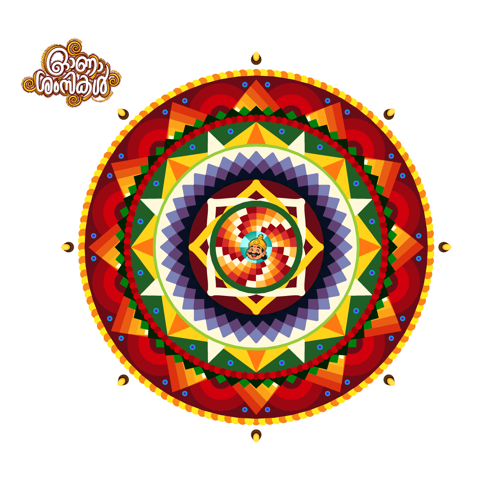

# Code-A-Pookalam 2026 using Python Turtle

This project was created as part of **Code-A-Pookalam 2026** organized by **FOSS MEC**. It is a Python Turtle program that draws a colorful digital Pookalam, a traditional floral design associated with Kerala's Onam festival.

## Table of Contents

- [Introduction](#introduction)
- [Preview](#preview)
- [Features](#features)
- [Installation](#installation)
- [How to Run](#how-to-run)
- [Customization](#customization)
- [Credits](#credits)
- [License](#license)

## Introduction

The Pookalam is one of the most recognizable parts of Onam celebrations. This 2026 entry uses Python's Turtle graphics to build a layered radial design with repeated geometric patterns, concentric color bands, petal-like forms, diyas, and festive image assets.

The code is modularized into small root-level Python files so each design layer can be understood and adjusted independently.

## Preview



## Features

- Multi-layer radial Pookalam generated with Python Turtle.
- Symmetric outer rings with orange, yellow, red, green, violet, blue, and off-white patterns.
- Reusable helper functions for circles, rings, triangles, petals, polygons, and color blending.
- Maveli image placed at the center of the design.
- Malayalam Onam wish image placed around the Pookalam.
- Diyas arranged around the outer ring.
- Modular code organization with each Python file kept under 100 lines.

## Installation

### Clone the Repository

```bash
git clone https://github.com/AaronKurian/pookalam-2026.git
cd pookalam-2026
```

### Install Requirements

Make sure Python 3.x is installed. This project uses Python's built-in `turtle` module and Pillow for placing PNG image assets.

```bash
python3 -m venv .venv
source .venv/bin/activate
pip install -r requirements.txt
```

## How to Run

Run the program with:

```bash
python main.py
```

A Turtle graphics window will open and draw the Pookalam. Click inside the Turtle window to close it after the drawing is complete.

### Note

For the best view, maximize the Turtle window before or during execution so the full Pookalam and wish image are visible.

## Customization

- Colors: Update the hex values inside the layer modules.
- Shapes: Adjust radii, counts, angles, and widths in the pattern functions.
- Center: Replace `maveli.png` to use a different center image.
- Wish: Replace `wish.png` to use a different festive greeting.
- Speed: Change `pen.speed(6)` in `composition.py`.

## Credits

This project was created for the Code-A-Pookalam 2026 contest by FOSS MEC. It is inspired by traditional Onam Pookalams and earlier Code-A-Pookalam entries.

## License

This project is licensed under the MIT License. Feel free to use and modify the code as per the [license](LICENSE) terms.

Made with love by Aaron Kurian Abraham.
